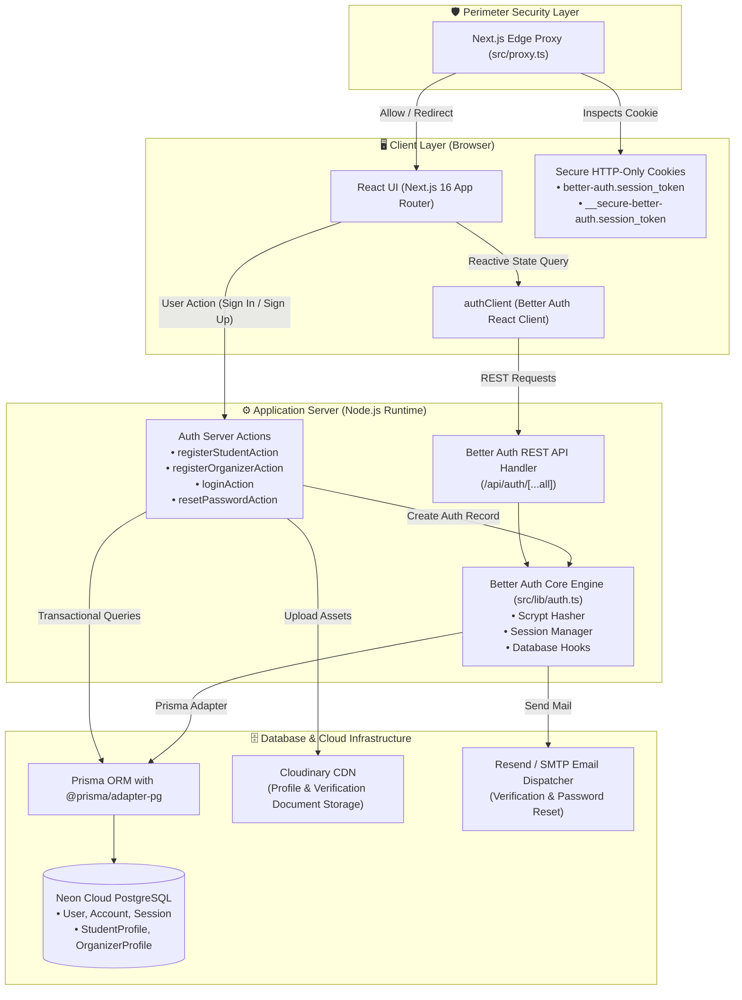
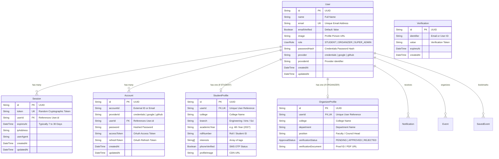
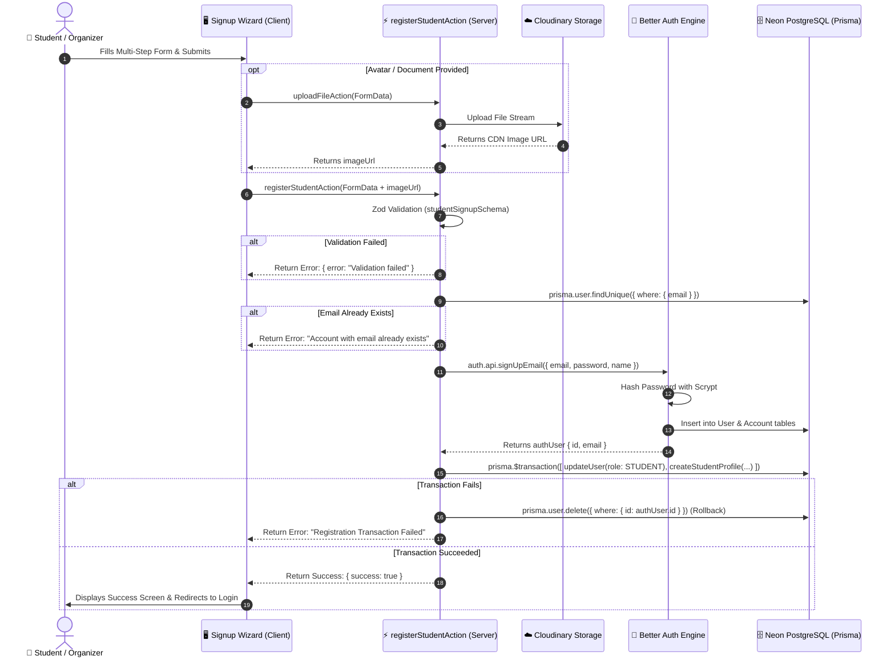
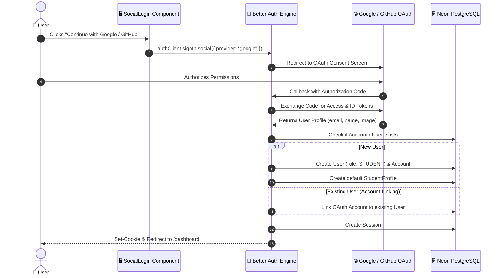
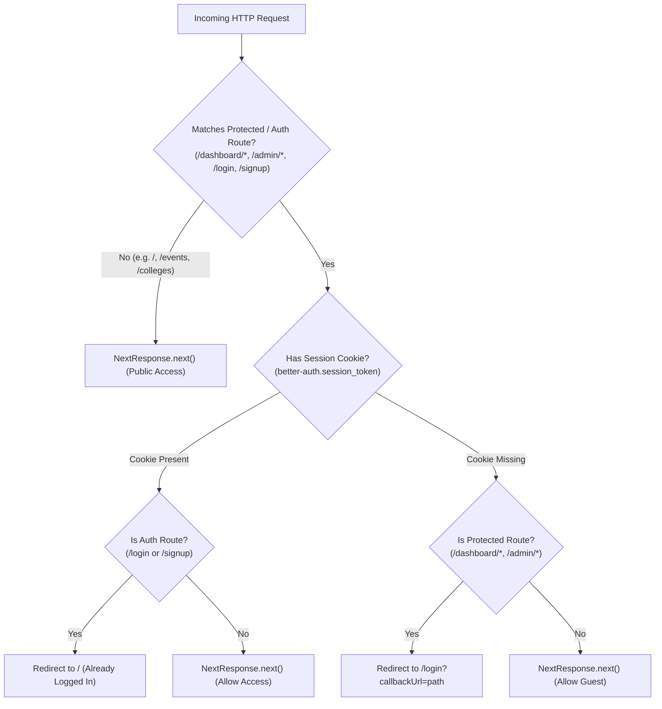
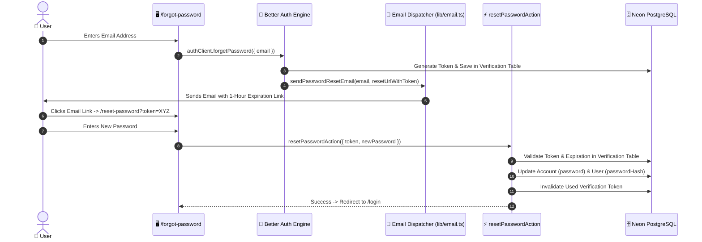

# 🔐 CollegeEvents — Complete Authentication Architecture & Lifecycle Flow

This document provides a comprehensive, end-to-end architectural breakdown of the **Authentication, Authorization, Identity Management, and Session Lifecycle** in the **CollegeEvents** platform.

---

## 📑 Table of Contents
1. [High-Level Architecture Overview](#1-high-level-architecture-overview)
2. [Database ERD & Identity Data Schema](#2-database-erd--identity-data-schema)
3. [Sign-Up Architecture & Flow](#3-sign-up-architecture--flow)
   - [Student Registration Flow](#31-student-registration-flow)
   - [Organizer Registration & Approval Flow](#32-organizer-registration--approval-flow)
   - [Sign-Up Sequence Diagram](#33-sign-up-sequence-diagram)
4. [Sign-In Architecture & Flow](#4-sign-in-architecture--flow)
   - [Credential Authentication Flow](#41-credential-authentication-flow)
   - [Sign-In Sequence Diagram](#42-sign-in-sequence-diagram)
5. [OAuth 2.0 / Social Login Flow (Google & GitHub)](#5-oauth-20--social-login-flow-google--github)
6. [Session Lifecycle & Edge Proxy Guard (`proxy.ts`)](#6-session-lifecycle--edge-proxy-guard-proxyts)
7. [Client & Server Session Consumption Matrix](#7-client--server-session-consumption-matrix)
8. [Password Reset & Email Verification Subsystem](#8-password-reset--email-verification-subsystem)
9. [Security Measures, Rollback Mechanisms & Error Matrix](#9-security-measures-rollback-mechanisms--error-matrix)

---

## 1. High-Level Architecture Overview

The CollegeEvents authentication system is built on a **Hybrid Architecture** combining:
- **Better Auth Framework (`src/lib/auth.ts`)**: Handles core crypto, session tokens, account linking, OAuth 2.0, cookie security, and credential hashing (`scrypt`/`bcrypt`).
- **Prisma ORM & PostgreSQL (Neon Cloud) (`src/lib/prisma.ts`)**: Relational database storing user records, roles, rich student profiles, organizer verification documents, and audit logs.
- **Next.js 16 Edge Proxy (`src/proxy.ts`)**: Zero-latency perimeter middleware that validates session cookies and routes traffic based on authentication state.
- **Server Actions (`src/actions/auth/*`)**: Type-safe transactional mutations executing business validation, rollback-safe provisioning, and profile creation.
- **Client Session Context (`src/lib/auth-client.ts`)**: Reactive React hooks (`useSession()`) with optimistic client state updates.

### 🏛️ System Topology Diagram



---

## 2. Database ERD & Identity Data Schema

The authentication tables are mapped directly between **Better Auth specification** and custom **CollegeEvents domain models**:



---

## 3. Sign-Up Architecture & Flow

Registration supports two distinct personas with dedicated multi-step wizards:
1. **Student Persona**: Requires academic details, branch, graduation year, and interest tags.
2. **Organizer Persona**: Requires institution details, official position, verification proof, and enters an administrative approval queue.

### 3.1. Student Registration Flow
1. **Step 1: Personal Information** (`Name`, `Email`, `Password`, `Confirm Password` - min 8 chars).
2. **Step 2: Academic Details** (`College`, `Branch`, `Academic Year`, `Graduation Year`, `Roll Number`).
3. **Step 3: Interest Selection** (Multi-tag selector: `AI`, `Hackathon`, `Robotics`, `Design`, etc.).
4. **Step 4: Avatar Upload** (Direct upload to Cloudinary via `uploadFileAction`).
5. **Step 5: Transactional Execution**:
   - `registerStudentAction` validates data format with Zod schema (`studentSignupSchema`).
   - Checks if `email` already exists in `User` table.
   - Calls `auth.api.signUpEmail()` to hash credentials and provision `User` + `Account` rows.
   - Executes a **Prisma Database Transaction (`prisma.$transaction`)** to assign `role = "STUDENT"` and create the `StudentProfile`.
   - **Rollback Safety**: If the profile transaction fails, the created Better Auth user is automatically purged to eliminate orphaned rows.

### 3.2. Organizer Registration & Approval Flow
1. **Step 1: Admin Credentials** (`Name`, `Official College Email`, `Password`).
2. **Step 2: Institutional Authority** (`College / University`, `Department`, `Designation / Position`).
3. **Step 3: Identity Verification** (Upload ID card or authorization letter).
4. **Step 4: Submission & Approval**:
   - Creates `User` with `role = "ORGANIZER"`.
   - Creates `OrganizerProfile` with `verificationStatus = "APPROVED"` (or `"PENDING"` in strict mode).
   - Once verified, the organizer gains access to `/admin/*` routes.

---

### 3.3. Sign-Up Sequence Diagram



---

## 4. Sign-In Architecture & Flow

### 4.1. Credential Authentication Flow
1. **Client Submission (`src/app/(auth)/login/page.tsx`)**: User enters `email`, `password`, and optional `rememberMe` flag.
2. **Phase 1 — Pre-Check Server Action (`loginAction`)**:
   - Validates input format via Zod (`loginSchema`).
   - Looks up `User` and checks user role (`STUDENT`, `ORGANIZER`, `SUPER_ADMIN`).
   - If user is an `ORGANIZER`, checks if verification status is approved.
   - Returns role information to prepare client-side routing.
3. **Phase 2 — Better Auth Client Execution (`authClient.signIn.email`)**:
   - Sends credentials to REST endpoint `/api/auth/sign-in/email`.
   - Better Auth compares incoming password with the stored cryptographic hash in the `Account` table.
   - Generates a cryptographically random session token string.
   - Inserts session into `Session` table (`expiresAt: 7 to 30 days`).
   - Dispatches HTTP response setting the **Secure, HTTP-Only cookie `better-auth.session_token`**.
4. **Phase 3 — Role-Based Client Redirect**:
   - `ORGANIZER` / `SUPER_ADMIN` $\rightarrow$ redirected to `/admin`
   - `STUDENT` $\rightarrow$ redirected to `/dashboard` (or `callbackUrl` if specified).

---

### 4.2. Sign-In Sequence Diagram

```mermaid
sequenceDiagram
    autonumber
    actor User as 👤 User
    participant LoginUI as 🖥️ LoginPage (Client)
    participant PreCheck as ⚡ loginAction (Server Action)
    participant API as 🌐 /api/auth/sign-in/email (Better Auth)
    participant DB as 🗄️ Neon PostgreSQL
    participant Browser as 🍪 Browser Cookie Jar

    User->>LoginUI: Enters Email & Password -> Clicks "Sign In"
    LoginUI->>PreCheck: loginAction({ email, password })
    PreCheck->>DB: prisma.user.findUnique({ where: { email } })
    DB-->>PreCheck: Returns User Record & Role
    PreCheck-->>LoginUI: Pre-check OK { success: true, role: "STUDENT" }

    LoginUI->>API: authClient.signIn.email({ email, password, rememberMe })
    API->>DB: Query Account table for password hash
    DB-->>API: Returns Account row
    API->>API: Verify Password Hash (Scrypt)
    alt Invalid Password
        API-->>LoginUI: 401 Unauthorized { message: "Invalid credentials" }
        LoginUI->>User: Displays Error Toast
    else Valid Credentials
        API->>DB: Insert new Session (token, userId, expiresAt)
        API-->>Browser: Set-Cookie: better-auth.session_token=xxx; HttpOnly; SameSite=Lax; Path=/
        API-->>LoginUI: 200 OK { session, user }
        alt role == "ORGANIZER"
            LoginUI->>User: Redirect to /admin
        else role == "STUDENT"
            LoginUI->>User: Redirect to /dashboard
        end
    end
```

---

## 5. OAuth 2.0 / Social Login Flow (Google & GitHub)

The application supports seamless 1-click social authentication configured in `src/lib/auth.ts`:



---

## 6. Session Lifecycle & Edge Proxy Guard (`proxy.ts`)

In Next.js 16, route protection is enforced at the network perimeter via **`src/proxy.ts`** before any React tree is evaluated:



### 🔒 Route Guard Rules Matrix

| Route Pattern | Unauthenticated Visitor | Authenticated Student | Authenticated Organizer / Admin |
|---|---|---|---|
| `/` (Homepage) | ✅ Allowed | ✅ Allowed | ✅ Allowed |
| `/events`, `/events/[slug]` | ✅ Allowed | ✅ Allowed | ✅ Allowed |
| `/login`, `/signup` | ✅ Allowed | 🔄 Redirects to `/` | 🔄 Redirects to `/` |
| `/dashboard/*` | ⛔ Redirects to `/login?callbackUrl=/dashboard` | ✅ Allowed | ✅ Allowed |
| `/admin/*` | ⛔ Redirects to `/login?callbackUrl=/admin` | ⛔ Blocked (Forbidden) | ✅ Allowed |
| `/api/attendance/verify` | ⛔ 401 Unauthorized | ⛔ 403 Forbidden | ✅ 200 OK |

---

## 7. Client & Server Session Consumption Matrix

The platform provides dual mechanisms to consume authenticated session data depending on the execution context:

### 1. In Server Components & Server Actions (`Node.js Server`)
```ts
import { auth } from "@/lib/auth";
import { headers } from "next/headers";

export async function ServerActionOrPage() {
  // Reads incoming session cookie from request headers
  const session = await auth.api.getSession({
    headers: await headers(),
  });

  if (!session?.user) {
    throw new Error("Unauthorized");
  }

  const userId = session.user.id;
  const userRole = session.user.role; // "STUDENT" | "ORGANIZER" | "SUPER_ADMIN"
}
```

### 2. In Client Components (`Browser React Tree`)
```tsx
"use client";
import { authClient } from "@/lib/auth-client";

export function UserProfileBadge() {
  const { data: session, isPending } = authClient.useSession();

  if (isPending) return <div>Loading...</div>;
  if (!session) return <a href="/login">Sign In</a>;

  return (
    <div>
      
      <span>{session.user.name}</span>
      <span>{session.user.email}</span>
    </div>
  );
}
```

---

## 8. Password Reset & Email Verification Subsystem



---

## 9. Security Measures, Rollback Mechanisms & Error Matrix

### 🛡️ Security Defenses Implemented

| Security Layer | Implementation Mechanism | Purpose |
|---|---|---|
| **Password Hashing** | Better Auth Scrypt algorithm + Salt | Protects credentials against rainbow tables and brute force. |
| **Session Security** | 256-bit cryptographically random tokens stored in database with TTL | Prevents session hijacking; tokens are revocable instantly. |
| **Cookie Hardening** | `HttpOnly`, `SameSite=Lax`, `Secure` (Production) | Immunizes session cookies against Cross-Site Scripting (XSS). |
| **SQL Injection Prevention** | Prisma Type-Safe Query Engine + Parameterized SQL | Prevents malicious query injections across all auth queries. |
| **Atomic Rollback** | `prisma.$transaction` + Manual Catch Deletion Cleanup | Ensures zero half-created/orphaned users if profile creation fails. |
| **Driver SSL Normalization** | `sslmode=require&uselibpqcompat=true` in `prisma.ts` | Eliminates Postgres SSL alias security warnings and ensures encrypted transit. |

---

### 🚨 Common Errors & Resolution Matrix

| Scenario | Root Cause | Resolution |
|---|---|---|
| `Account already exists` | Attempting signup with an already registered email. | Redirect user to `/login` or prompt password recovery. |
| `Dual Middleware Error` | Coexistence of `middleware.ts` and `proxy.ts` in Next 16. | Remove `middleware.ts`; consolidate all route guards in `src/proxy.ts`. |
| `Session desynchronization` | Profile updated in DB, but client session cache was stale. | Call `router.refresh()` or re-fetch session via `authClient.getSession()`. |
| `SSL Warning on Startup` | Missing `uselibpqcompat=true` in PostgreSQL connection string. | Handled automatically in `src/lib/prisma.ts` connection sanitizer. |
| `Organizer Access Pending` | Verification document pending admin approval. | User is redirected to `/pending-approval` until status becomes `APPROVED`. |

---
*Generated and verified for CollegeEvents Platform.*
