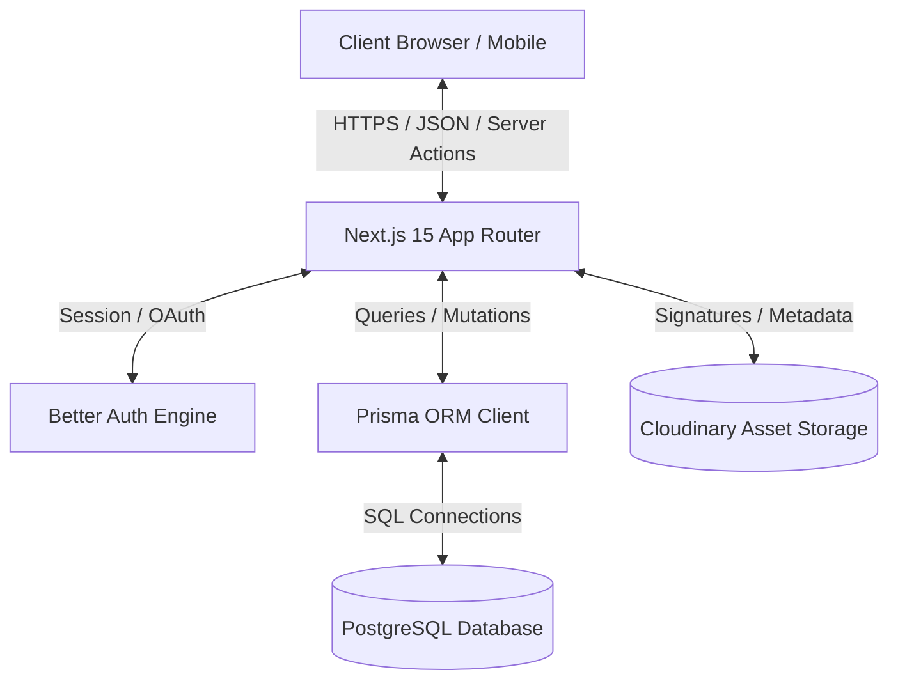
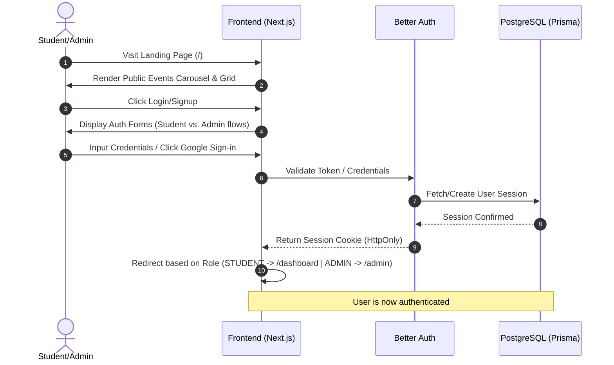
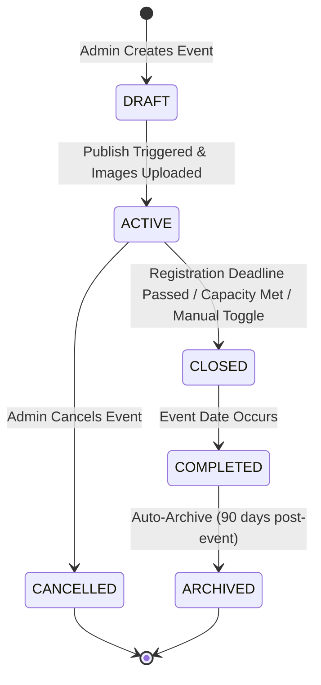
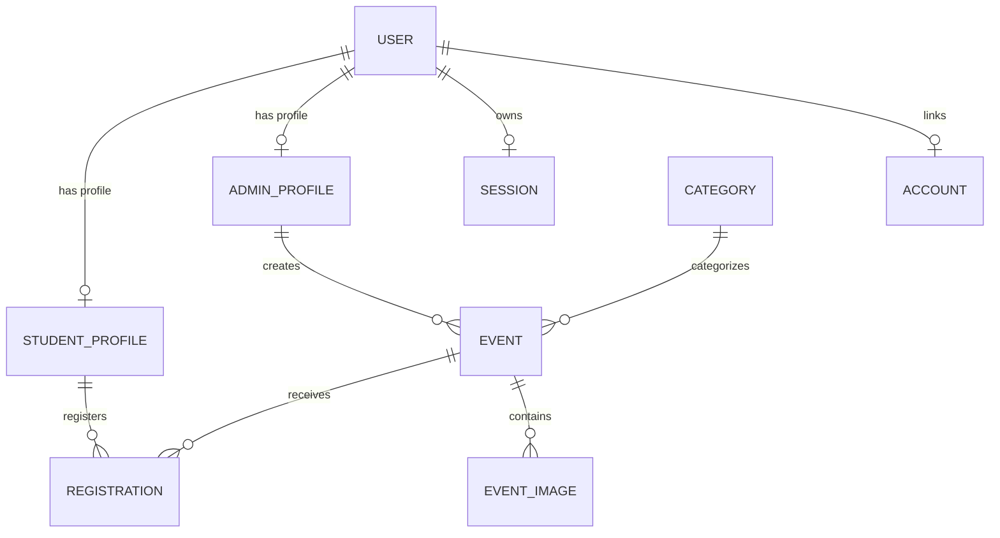
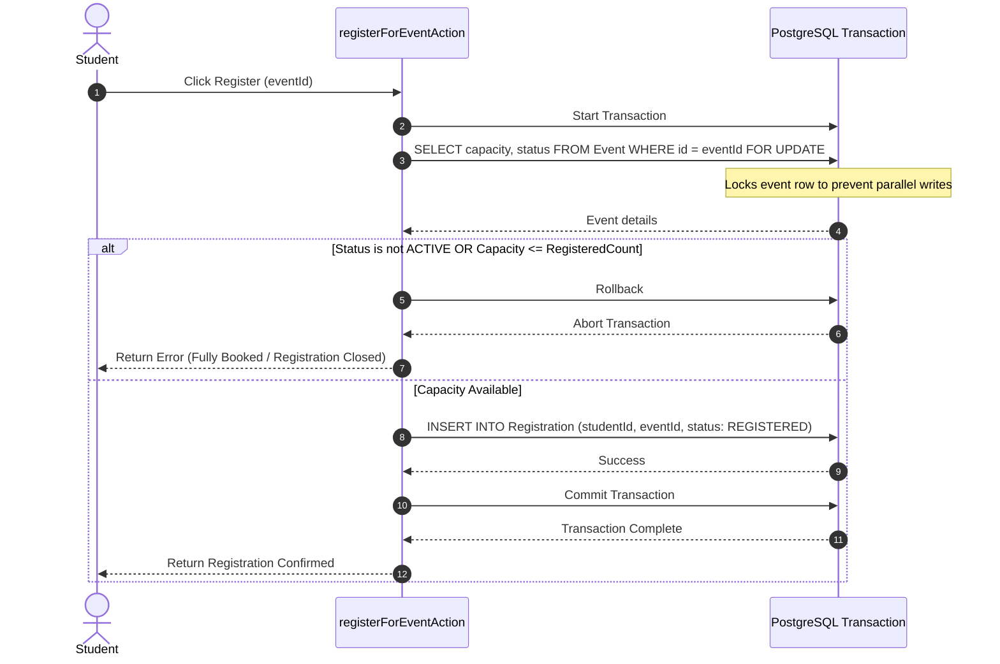

# College Events Management Platform – Technical Blueprint

This document serves as the complete, production-ready technical blueprint and single source of truth for the College Events Management Platform. Development must proceed strictly according to these architectural decisions, schemas, workflows, and guidelines.

---

## 1. Project Overview & Technology Stack

### Project Vision & Goals
The College Events Management Platform is an immersive, high-end web application designed for college students to discover, register for, and participate in events, and for administrators to publish and manage them. The platform aims to bridge the gap between student engagement and event coordination through a premium, responsive, and seamless digital experience.

### Technology Stack
*   **Frontend Framework:** Next.js 15 (App Router)
*   **Language:** TypeScript 5.x
*   **Styling:** Tailwind CSS 4.0 & Framer Motion (for smooth, high-fidelity UI transitions)
*   **Database:** PostgreSQL (hosted on neon.tech or AWS RDS)
*   **Object-Relational Mapping (ORM):** Prisma ORM
*   **Authentication & Session Management:** Better Auth (Google OAuth & Email/Password credentials)
*   **Image Cloud Storage:** Cloudinary (Direct-to-Cloud client uploads with secure server-signed signatures)
*   **Deployment:** Vercel (CI/CD integration via GitHub)

---

## 2. Product Architecture

The system utilizes a modern, decoupled layer architecture running inside a Next.js App Router environment:



### Decoupled Layers
1.  **Presentation Layer:** Dynamic React Server Components (RSC) for page layouts and static pages. Interactive Client Components (fenced with `"use client"`) for event carousels, maps, forms, and dialogs.
2.  **Business Logic (Server Actions):** Secure asynchronous server functions executing on the Node.js runtime. Used for operations like register-for-event, update-profile, create-event.
3.  **Authentication/Authorization Guard:** Next.js middleware and Better Auth sessions inspecting JSON Web Tokens (JWT) or secure database-backed session cookies.
4.  **Data Access Layer:** Prisma Client serving as the type-safe interface to the PostgreSQL database, executing query compositions and transaction-locked statements.
5.  **Asset Management:** Direct-to-Cloud uploads minimizing Next.js server CPU/Memory footprint by sending images directly from the browser to Cloudinary.

---

## 3. Landing & Homepage Planning

The entry experience must conform strictly to the layout and motion guidelines outlined in [design.md](file:///Users/vishwadipdamodare/Desktop/collegeEvent/design.md).

### Landing Page Sections
1.  **Immersive Hero Area:** Full-screen portrait/landscape background image featuring dynamic event photography (Tech Fest, Cultural Night, Hackathons). A dark black gradient overlay (35–50% opacity) ensures text contrast.
2.  **Navigation Bar:** Transparent by default; turns into a glassmorphism navbar (backdrop-blur-md background) upon scrolling. Includes distinct login/registration triggers for Students vs. Admins.
3.  **Featured Event Carousel:** Located on the left (occupying 60% viewport width) featuring massive bold typography, a short description, and clear CTAs. The right side (40% width) hosts overlapping vertical portrait cards showing upcoming event previews.
4.  **Upcoming Events Grid:** Responsive grid showcasing chronological event teasers with smooth scroll-fade animations.
5.  **College Showcase:** Highlights participating partner colleges and host institutions using elegant card panels.
6.  **Interactive Category Badges:** One-click filter pill badges allowing immediate transition to search results.
7.  **Call to Action & Footer:** Encourages signups with custom interactive forms.

### Homepage Data Fetching & Caching
*   **Strategy:** Combine React Server Components (RSC) with Next.js dynamic caching.
*   **RSC Implementation:** The root page `/page.tsx` fetches the initial set of featured events, upcoming events, and categories directly from the database using Prisma inside the server render loop.
*   **Revalidation:** Utilize time-based revalidation (`export const revalidate = 60` seconds) on the homepage data fetching to ensure event availability changes propogate, while avoiding hit overhead on PostgreSQL.

---

## 4. Website Routing Architecture

The Next.js App Router layout is mapped as follows:

```
/                             (Public Homepage)
├── login                     (Centralized Login Page)
├── signup
│   ├── student               (Student Registration Form)
│   └── admin                 (Admin Registration Form)
├── events
│   ├── page.tsx              (Public Event Search & Filter list)
│   └── [id]
│       └── page.tsx          (Event Detail View - Dynamic RSC)
├── dashboard                 (Student Portal - Protected)
│   ├── page.tsx              (Registered Events, Profile Summary)
│   └── profile
│       └── page.tsx          (Student Profile Editor)
└── admin                     (Admin Panel - Protected)
    ├── page.tsx              (Admin Analytics Dashboard)
    ├── events
    │   ├── page.tsx          (Admin Event Catalog Table)
    │   ├── create
    │   │   └── page.tsx      (Create Event Form)
    │   └── edit
    │       └── [id]
    │           └── page.tsx  (Edit Event Form)
    └── registrations
        └── page.tsx          (Student Registration Log Tracker)
```

---

## 5. Complete User Flow



### Student Flow
1.  **Land & Search:** Student browses public pages, searches by name, or filters by category (e.g., "Hackathon").
2.  **Authenticate:** Logs in or signs up specifically as a Student.
3.  **Detail View:** Navigates to `/events/[id]`. Reads information and views event images.
4.  **Register:** Clicks "Register". If capacity is available, the transaction executes, updating `/dashboard` with a confirmation badge.
5.  **Dashboard:** Accesses `/dashboard` to view upcoming registered events or cancel them.

### Admin Flow
1.  **Create Portal:** Signs up or logs in as an Admin.
2.  **Manage Catalog:** Navigates to `/admin`. Views dashboards and statistics.
3.  **Event Lifecycle:**
    *   Creates a new event via `/admin/events/create`.
    *   Uploads high-resolution images via Cloudinary signed forms.
    *   Saves draft or publishes event to the live landing page.
4.  **Roster Management:** Accesses `/admin/registrations` to view/export the student list or close registration manually.

---

## 6. Student Features Detail

### Feature SF-1: Public Event Search & Advanced Filters
*   **Purpose:** Allows students to discover relevant college events.
*   **UI Components:** Search input with debounce, category pill selectors, date pickers, college dropdowns.
*   **Backend Logic:** A Server Action (`getEventsAction`) or dynamic API route (`/api/events`) parsing search parameters.
*   **Database Query:**
    ```typescript
    prisma.event.findMany({
      where: {
        status: "ACTIVE",
        title: { contains: searchString, mode: 'insensitive' },
        categoryId: categoryFilterId,
        date: { gte: startDateFilter }
      },
      include: { category: true, images: true },
      orderBy: { date: 'asc' }
    });
    ```
*   **Security:** Rate-limit request frequency on `/api/events`. Sanitize search inputs.

### Feature SF-2: Event Registration & Confirmation
*   **Purpose:** Allows students to book seats for events.
*   **UI Components:** "Register Now" button, animated loading state, modal confirmation.
*   **Backend Logic:** Server Action `registerForEventAction(eventId: string)`.
*   **Database Query:** Executed inside an interactive transaction to prevent overbooking (see Section 14).
*   **Security:** Requires active authenticated session, user role check (`role === STUDENT`), verification of deadline, double-registration checks.

---

## 7. Admin Features Detail

### Feature AF-1: Create Event with Direct Cloudinary Upload
*   **Purpose:** Publish new events with rich image galleries.
*   **Workflow:**
    1.  Admin inputs details (title, capacity, location, date).
    2.  Files are staged in client. Client requests signature from `/api/cloudinary/sign`.
    3.  Client uploads images directly to Cloudinary.
    4.  Admin submits the form containing the Cloudinary asset URLs via Server Action `createEventAction`.
*   **Prisma Write:**
    ```typescript
    prisma.event.create({
      data: {
        title, description, date, capacity, location, adminId, categoryId,
        images: {
          createMany: {
            data: imagePaths.map(url => ({ url, isHero: false }))
          }
        }
      }
    });
    ```

### Feature AF-2: Registration Closure & Roster Exports
*   **Purpose:** Allow administrators to freeze registration and pull student rosters.
*   **Backend Logic:** Server Action `toggleEventStatusAction(eventId: string, isClosed: boolean)`. Renders student names, emails, and registration timestamps to a CSV payload.
*   **Security:** Checked against `role === ADMIN` and verifying the admin matches the `adminId` (event owner) or has global admin privileges.

---

## 8. Event Lifecycle Status Machine



---

## 9. Component Architecture & Props Contracts

All layout components must enforce strict styling compliance with [design.md](file:///Users/vishwadipdamodare/Desktop/collegeEvent/design.md).

### Component: `EventCard` (Client/Server Hybrid)
*   **Type:** Client Component (handles hover lifting animations and pointer interactions).
*   **Props:**
    ```typescript
    interface EventCardProps {
      id: string;
      title: string;
      college: string;
      date: Date;
      categoryName: string;
      imageUrl: string;
      isActive?: boolean;
      onClick?: () => void;
    }
    ```

### Component: `HeroSection` (Server Component Wrapper)
*   **Type:** Server Component (fetches featured events data, feeds layout state down to dynamic client sub-components).
*   **Children:** `Navbar` (Client/Scroll-active), `EventCardCarousel` (Client/Interactive).

---

## 10. Database Schema Design (PostgreSQL)



### Prisma Schema (`prisma/schema.prisma`)

```prisma
datasource db {
  provider          = "postgresql"
  url               = env("DATABASE_URL")
  directUrl         = env("DIRECT_URL") // Used for serverless pooled instances
}

generator client {
  provider = "prisma-client-js"
}

enum Role {
  STUDENT
  ADMIN
}

enum EventStatus {
  DRAFT
  ACTIVE
  CLOSED
  CANCELLED
  COMPLETED
  ARCHIVED
}

enum RegistrationStatus {
  REGISTERED
  ATTENDED
  CANCELLED
}

model User {
  id             String          @id @default(uuid())
  email          String          @unique
  name           String
  role           Role            @default(STUDENT)
  emailVerified  Boolean         @default(false)
  image          String?
  createdAt      DateTime        @default(now())
  updatedAt      DateTime        @updatedAt

  studentProfile StudentProfile?
  adminProfile   AdminProfile?
  sessions       Session[]
  accounts       Account[]

  @@index([email])
}

model Session {
  id           String   @id @default(uuid())
  userId       String
  token        String   @unique
  expiresAt    DateTime
  ipAddress    String?
  userAgent    String?
  createdAt    DateTime @default(now())
  updatedAt    DateTime @updatedAt

  user         User     @relation(fields: [userId], references: [id], onDelete: Cascade)
}

model Account {
  id                    String    @id @default(uuid())
  userId                String
  accountId             String
  providerId            String
  accessToken           String?
  refreshToken          String?
  accessTokenExpiresAt  DateTime?
  refreshTokenExpiresAt DateTime?
  scope                 String?
  idToken               String?
  password              String?
  createdAt             DateTime  @default(now())
  updatedAt             DateTime  @updatedAt

  user                  User      @relation(fields: [userId], references: [id], onDelete: Cascade)

  @@unique([providerId, accountId])
}

model StudentProfile {
  id            String         @id @default(uuid())
  userId        String         @unique
  collegeName   String
  department    String
  year          Int
  rollNumber    String         @unique
  createdAt     DateTime       @default(now())
  updatedAt     DateTime       @updatedAt

  user          User           @relation(fields: [userId], references: [id], onDelete: Cascade)
  registrations Registration[]
}

model AdminProfile {
  id          String   @id @default(uuid())
  userId      String   @unique
  department  String
  position    String
  createdAt   DateTime @default(now())
  updatedAt   DateTime @updatedAt

  user        User     @relation(fields: [userId], references: [id], onDelete: Cascade)
  events      Event[]
}

model Category {
  id        String   @id @default(uuid())
  name      String   @unique
  slug      String   @unique
  events    Event[]
}

model Event {
  id           String        @id @default(uuid())
  title        String
  description  String        @db.Text
  date         DateTime
  location     String
  capacity     Int
  isClosed     Boolean       @default(false)
  status       EventStatus   @default(DRAFT)
  adminId      String
  categoryId   String
  createdAt    DateTime      @default(now())
  updatedAt    DateTime      @updatedAt

  admin        AdminProfile  @relation(fields: [adminId], references: [id], onDelete: Cascade)
  category     Category      @relation(fields: [categoryId], references: [id], onDelete: Restrict)
  images       EventImage[]
  registrations Registration[]

  @@index([date])
  @@index([status])
  @@index([categoryId])
}

model EventImage {
  id        String   @id @default(uuid())
  eventId   String
  url       String
  isHero    Boolean  @default(false)
  createdAt DateTime @default(now())

  event     Event    @relation(fields: [eventId], references: [id], onDelete: Cascade)

  @@index([eventId])
}

model Registration {
  id             String             @id @default(uuid())
  eventId        String
  studentId      String
  status         RegistrationStatus @default(REGISTERED)
  createdAt      DateTime           @default(now())
  updatedAt      DateTime           @updatedAt

  event          Event              @relation(fields: [eventId], references: [id], onDelete: Cascade)
  student        StudentProfile     @relation(fields: [studentId], references: [id], onDelete: Cascade)

  @@unique([eventId, studentId]) // Prevents multi-registration race conditions
  @@index([eventId])
  @@index([studentId])
}
```

---

## 11. Folder Directory Structure

Because Next.js is a full-stack framework, the frontend and backend files are physically organized within the same `src` directory but are logically separated as follows:

### 🎨 Frontend (Presentation Layer)
```
src/
├── app/                       # Next.js App Router (Pages & Layouts)
│   ├── layout.tsx             # Root layout containing Providers
│   ├── page.tsx               # Homepage / Landing route
│   ├── login/                 # Better Auth Login UI
│   ├── signup/                # Student & Admin registration flows
│   ├── events/                # Event search and detail views
│   ├── dashboard/             # Student dashboard & profile
│   └── admin/                 # Admin dashboards & management tables
├── components/                # React UI Components
│   ├── ui/                    # Reusable primitive blocks (buttons, dialogs, tags)
│   ├── home/                  # Landing page specific components (Hero, Carousel)
│   ├── events/                # Event search and filtering layout files
│   └── layout/                # Global Navbar, Footer components
└── hooks/                     # Custom client-side React hooks
```

### ⚙️ Backend (Business Logic & Data Access)
```
src/
├── actions/                   # Server Actions (Backend API / Mutations)
│   ├── auth.ts                # Login, registration trigger functions
│   ├── events.ts              # CRUD event server actions
│   └── register.ts            # Concurrency event booking logic
└── lib/                       # Server-side integrations & utilities
    ├── auth.ts                # Better Auth server config
    ├── db.ts                  # Cached Prisma Client instance
    └── cloudinary.ts          # Server-side upload helpers
```

### 🤝 Shared (Types & Utilities used by both)
```
src/
├── lib/
│   └── auth-client.ts         # Better Auth client hook references
├── types/                     # Shared TS types and database models
└── validators/                # Zod schemas for input payloads
```

---

## 12. Security, Authentication & Role Matrix

### Authorization Matrix
*   Guests/Unauthenticated: View Landing, Browse/Filter Events, Read Event details.
*   Students: Perform actions listed above, plus: Register for event, edit StudentProfile, cancel their own registration.
*   Admins: Create event, edit event, delete event, view registrations roster, close registration, access `/admin` dashboard analytics.

### Route Protection Middleware (`src/middleware.ts`)
```typescript
import { NextResponse } from "next/server";
import type { NextRequest } from "next/server";
import { getSession } from "@/lib/auth"; // Better Auth session utility

export async function middleware(request: NextRequest) {
  const session = await getSession(request);
  const path = request.nextUrl.pathname;

  if (!session) {
    if (path.startsWith("/dashboard") || path.startsWith("/admin")) {
      return NextResponse.redirect(new URL("/login", request.url));
    }
  } else {
    const role = session.user.role;
    if (path.startsWith("/admin") && role !== "ADMIN") {
      return NextResponse.redirect(new URL("/dashboard", request.url));
    }
    if (path.startsWith("/dashboard") && role !== "STUDENT") {
      return NextResponse.redirect(new URL("/admin", request.url));
    }
  }

  return NextResponse.next();
}

export const config = {
  matcher: ["/dashboard/:path*", "/admin/:path*"],
};
```

---

## 13. High-Concurrency Event Registration Flow

To prevent overbooking events with limited capacity (e.g. 50 seats for a hackathon) during high traffic, all registration requests must use database-level transactional concurrency controls.



### Prisma Interactive Transaction Execution
```typescript
export async function registerForEvent(studentId: string, eventId: string) {
  return await db.$transaction(async (tx) => {
    // 1. Lock the event row for updates
    const event = await tx.$queryRaw<Array<{ capacity: number, isClosed: boolean, status: string }>>`
      SELECT capacity, "isClosed", status 
      FROM "Event" 
      WHERE id = ${eventId} 
      FOR UPDATE
    `;

    if (!event || event.length === 0) {
      throw new Error("Event not found");
    }

    const { capacity, isClosed, status } = event[0];

    if (isClosed || status !== "ACTIVE") {
      throw new Error("Registration for this event is closed");
    }

    // 2. Fetch current registrations count
    const registeredCount = await tx.registration.count({
      where: { eventId, status: "REGISTERED" }
    });

    if (registeredCount >= capacity) {
      throw new Error("Event capacity has been reached");
    }

    // 3. Create the registration
    return await tx.registration.create({
      data: {
        studentId,
        eventId,
        status: "REGISTERED"
      }
    });
  });
}
```

---

## 14. Non-Functional & Strategy Guidelines

### Performance (Core Web Vitals)
*   **Largest Contentful Paint (LCP):** Preload the hero image of the featured event. Background animations must execute on GPU-accelerated layout transforms (`transform: translate3d()` and `opacity`) rather than height/width modifications.
*   **Interaction to Next Paint (INP):** Ensure all navigation controls in the Event Carousel execute immediately with transition timers under 200ms. Utilize React's `useTransition` when rendering filtered results.
*   **Image Compression:** Utilize Next.js `next/image` with format conversions to WebP/AVIF and automated sizing to ensure responsive image sizes are delivered to mobile screens.

### Security Implementation
*   **Rate Limiting:** Implement token bucket rate limiting on sensitive API pathways (`/api/auth/*` and `registerForEventAction`).
*   **CSRF Protection:** Managed natively by Better Auth sessions using anti-CSRF token synchronization.
*   **Input Sanitization:** Standardize payload parsing using `zod` schema validators before executing SQL queries or committing mutations.

---

## 15. Future Expansion Paths

Architectural hooks will be left in the code to ease future implementation of:
1.  **QR Roster Scan:** The `Registration` model's `id` acts as the unique UUID token. Future QR generation tools can query `/api/attendance/verify?ticketId=[id]` to scan students on-site.
2.  **Payment Gateway Hook:** The `Registration` status schema includes hooks to change status from `PENDING_PAYMENT` to `REGISTERED` via webhook receivers from Stripe or Razorpay.

---

## 16. Verification Plan

### Automated Checks
*   Run `npx prisma validate` to confirm schema relationships and syntax correctness.
*   Run compiler check `npm run build` during setup steps to confirm route typings.

### Manual Inspection Checklist
*   Verify that `studentProfile` cannot modify `adminProfile` paths and vice versa.
*   Simulate high registration counts to confirm registration gates shut down when capacity limits are hit.
*   Review the final homepage visual execution matches the glassmorphism and animation pacing criteria detailed in [design.md](file:///Users/vishwadipdamodare/Desktop/collegeEvent/design.md).